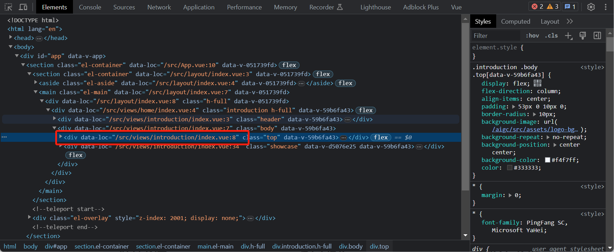
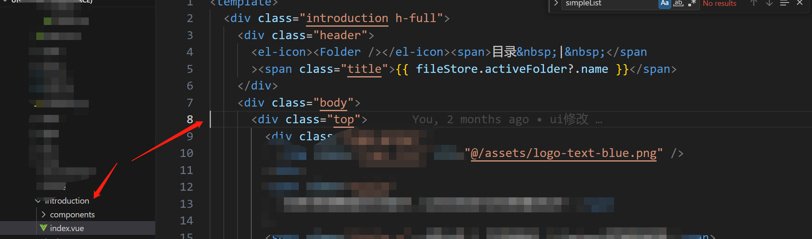

# vite-plugin-jump-code

代码一键跳转，开发利器。

## 环境准备

node 版本 16+
### 安装

```
pnpm i vite-plugin-jump-code -D
```

### 配置

```js
// vite.config.js 已省略其他配置
import jumpCode from 'vite-plugin-jump-code'
export default defineConfig({
    plugins: [jumpCode()],
})
```

### 使用

window 快捷键，ctrl和鼠标左键，即可跳转对应节点。
项目启动之后查看浏览器节点，能看到 data-loc 节点被插入




